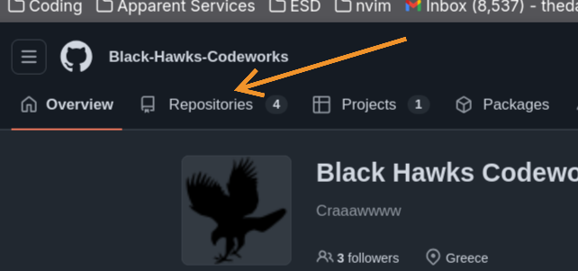
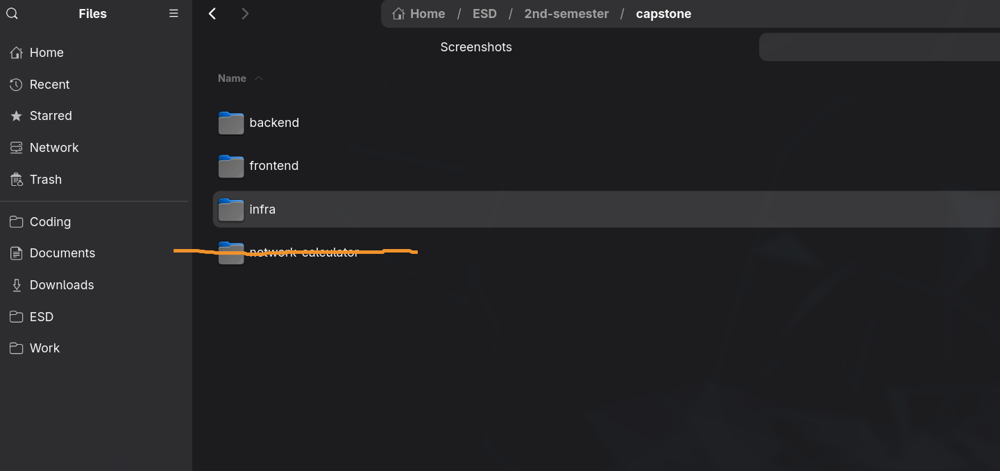
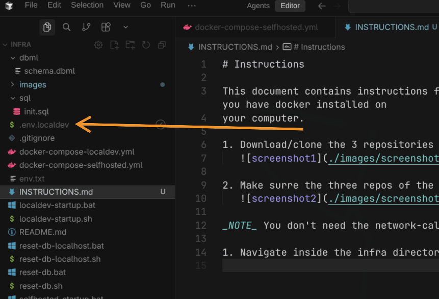
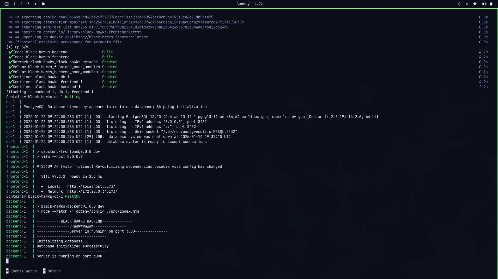
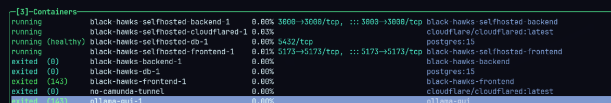

# Instructions

This document contains instructions for how to run the capstone project of the
blackhawks. Before you start make sure that you have docker installed on your computer.

## Running the project Localy

1. Download/clone the 3 repositories from [github.com](https://github.com/Black-Hawks-Codeworks/).
   

2. Make surre the three repos of the capstone are in the same folder.
   

_NOTE_ You don't need the network-calculator repo it is hosted on Vercel [here](https://network-calculator-two.vercel.app)

1. Navigate inside the infra directory and copy the **.env.localdev** file that
   was contained in the email.
   **IMPORTANT** Windows has the bad habit to erase the first "." for the name of
   the file. Make sure the "." exists.
   

2. While in infra/ if you are on linux or mac run the localdev-startup.sh file.
   For Windows run localdev-startup.bat. This will download the relevant images
   from docker hub and build the containers and the docker network.
   Keep the terminal open. To stop the containers CTRL+C on the terminal.

   ```bash
   ./localdev-startup.sh
   ```

   ```bash
   .\localdev-startup.bat
   ```

   If all goes well you will see something like this.



The frontend is available in your browser [here](http://localhost:5173)

The backend is running [here](http://localhost:3000). Also Swagger can be found [here](http://localhost:5173/docs).

The Postgres DB can be accessed with a database viewer(like DBeaver)
[here](http://localhost:5432). Credentials in the **.env.localdev** .
_NOTE_ The SQL was not used in the final project. The data is actually stored
in the backend/ using LowDb.

## Selfhosting

To host the project on the internet stop the containers(if up), and run the
**selfhosted-startup.sh/bat**. This will add a 4th container to the project
that tunnels the <http://localhost:5173> to this domain:
[https://dev.ohi-stin-camunda-nai-ston-erota.site/](https://dev.ohi-stin-camunda-nai-ston-erota.site/)

```bash
./selfhosted-startup.sh
```

```bash
.\selfhosted-startup.bat
```

To stop CTRL+C on the terminal.

Here is an screenshot of lazydocker will selfhosted-startup.sh is running.
Note how localdev and hosted enviroments have different container...



More info for each tier of the project can be found in the respective
README.md of each repo.
